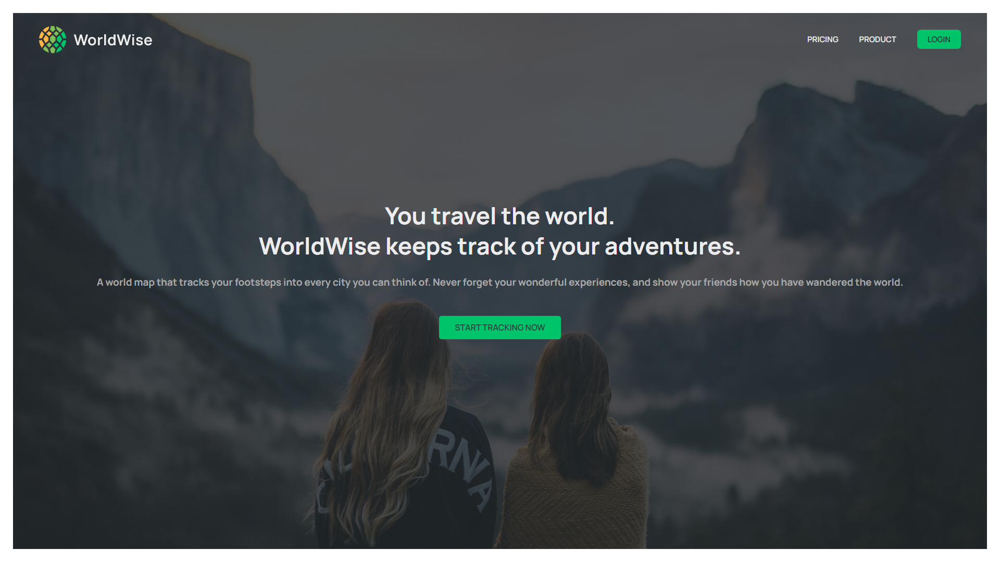
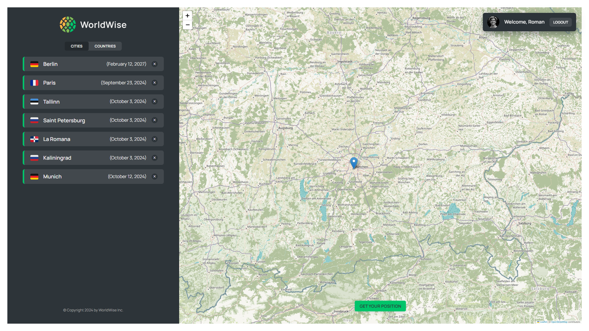
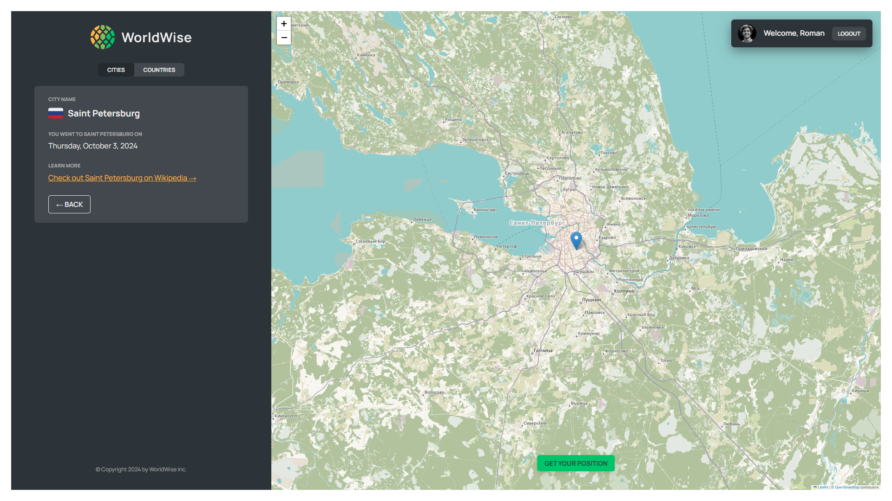
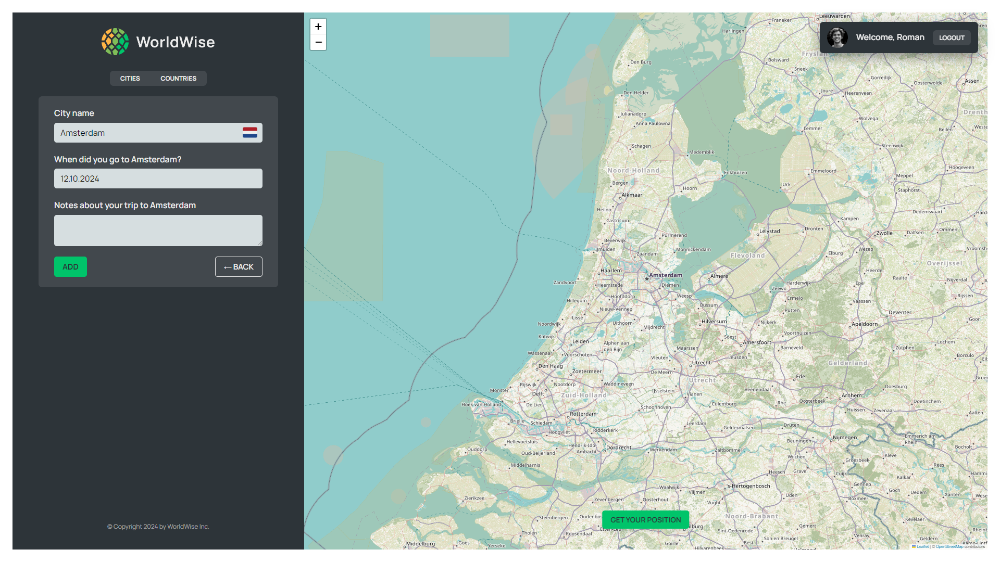

# WorldWise App

## Tools used:

-   Vite
-   React 18
-   React Router 6
-   Leaflet library
-   Context + useReducer
-   Json Server
-   Navigate
-   useNavigate
-   Spliting Components with React Lazy
-   React Memo (memo, useMemo, useCallback)
-   React Custom Hooks
-   Geolocation API
-   React DatePicker
-   Fake Auth

[Link to project](https://world-wise-nine-neon.vercel.app/)
